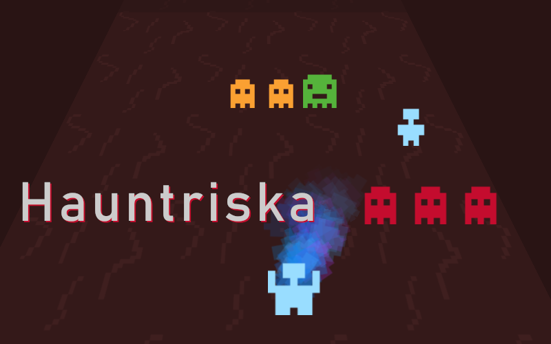

# Hauntriska

This game is an entry for the [js13kGames 2024](https://js13kgames.com) game jam for the theme "triskaidekaphobia" (meaning "fear or avoidance of the number 13"), it was made in 14 hours in JavaScript/HTML5/CSS3.

The color palette is based on [Jehkoba64](https://lospec.com/palette-list/jehkoba64) by Jehkoba, the sounds are made using [ZzFX](https://github.com/KilledByAPixel/ZzFX) by KilledByAPixel, everything else is own work.

Play it here: https://dev.js13kgames.com/2024/games/hauntriska
